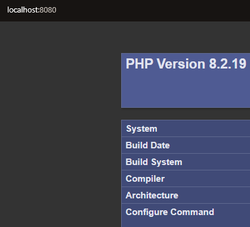
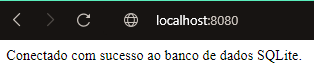

# PHP sem nada de Xampp e com muito Xdebug no Windows

Uma coisa que já é sabida há um bom tempo é que NÃO precisamos usar o Xampp para montarmos um bom ambiente de desenvolvimento, mas voce pode argumentar que o próprio site oficial do PHP na [Instalação no Windows](https://www.php.net/manual/pt_BR/install.windows.php) recomenda fazer uso dele por ser mais pratico, concordo totalmente com essa afirmativa, mas o problema é que além de PHP são instalados outra ruma de tranqueiras que são desnecessárias. Caso queira entender o motivo dessas ferramentas serem desnecessárias minha sugestão é assistir o video do Vinícius Dias de nome: [XAMPP: Por Que Este Não Deve Ser seu Ambiente de Desenvolvimento](https://www.youtube.com/watch?v=XgJbv1itIOE). Chega de conversa fiada e vamos para a configuração.


# Índice

  - [Instalando O PHP no Windows](#instalando-o-php-no-windows)
  - [Instalando o Xdebug](#instalando-o-xdebug)
  - [VScode e suas extensões](#vscode-e-suas-extensões)
  - [Usando o SQLite](#usando-o-sqlite)


# Instalando O PHP no Windows
Para instalar o PHP no windows basta somente 3 passos, primeiro que vamos baixar os arquivos zipados no linK: [PHP para windows](https://windows.php.net/download/), importante mencionar que talvez seja necessário instalar o **Visual C++ Redistributable for Visual Studio**, verifique antes no seu windows ele está instalado, caso contrário basta baixar neste link: [Visual C++ Redistributable](https://aka.ms/vs/16/release/VC_redist.x64.exe), instalação padrão do windows, faz *next* até aparecer o *finish*. 

O próprio site explica as diferenças entre as versões disponíveis, para este exemplo vou usar o **PHP 8.2 (8.2.19)** com a versão **VS16 x64 Thread Safe (2024-May-08 07:21:58)**, para a gente vamos somente baixar o arquivo .ZIP como mostrado na figura.


Feito isso, vamos agora descompactar a o zip, mas antes crie um diretório na raiz do disco C do windows, vai ficar assim **"C:\php"**. depois da árdua tarefa descompactar um arquivo, agora entre na pasta e encontrará de cara os arquivos ***php.ini-development***  e ***php.ini-production*** , faça uma copia do arquivo ***php.ini-development*** e renomeia para ficar somente **php.ini** o resultado final vai ser como o da imagem.


Estamos quase lá, falta agora nossas variáveis de ambiente, pesquise no menu iniciar do windows por *Editar as variáveis de ambiente*.


Agora clicando em *variáveis de ambiente*, vamos ter a seguinte tela.


Edite a variável **Path** e nela coloque o caminho da pasta do php: **"C:\php"**, seu PHP está instalado no windows, para verificar de fato se deu bom na instalação abra seu terminal e digite: ***php -v*** e o resultado é para ser.


Com isso você já pode fazer fazer seus programas com o PHP, mas aqui a gente quer colocar um ambiente de desenvolvimento arretado, então vamos configurar o gerenciador de pendencias do PHP o [commposer](https://getcomposer.org) e nossa ferramenta de debug o [Xdebug](https://xdebug.org).

Para instalar o composer basta fazer o [baixar o executável](https://getcomposer.org/download/) e mais uma vez basta fazer ***next*** e depois ***finish***. Se tudo estiver ocorrido como o desejado validamos rodando o comando. 

```
composer -v
``` 

E o resultado deve ser esse.


Com isso temos nosso PHP e composer devidamente instalado, agora vamos para nossa ferramenta de depuração.

# Instalando o Xdebug
Caso não conheça o essa ferramenta incrível, minha sugestão é fazer uma lida rápida na [Documentação do Xdebug](https://xdebug.org/docs/all_settings), aqui vou fazer a instalação e uma configuração básica que tenho usado no em meu ambiente local.

Primeiro vamos baixar a dll do Xdebug para windows, acessando o [link](https://xdebug.org/download#releases), agora tenha atenção para que a versão selecionada seja compatível com a versão de PHP usada no Windows.


Selecionada a versão correta, descompacte e mude o nome para **php_xdebug.dll**, em seguida adicione a extensão em *C:\php\ext*. Feito isso temos a extensão pronta, mas ainda precisamos habilitar para uso, fazemos isso editando o arquivo *php.ini*.

Pesquise dentro do *php,ini* por ***zend_extension=*** , provavelmente você irá encontrar algo desse tipo.
```
;zend_extension=opcache
```
Duplique a linha e modifique para que fique agora assim.
```
;zend_extension=opcache
zend_extension=xdebug
``` 
Basicamente o que estamos fazendo é **habilitar/ativar** o uso da extensão para nosso PHP local, mas só isso não é suficiente, precisamos acionar algumas coisas para deixar o Xdebug zero bala para o desenvolvimento. Ainda no arquivo *php.ini* role até o final do arquivo e acrescente o seguinte bloco.    

```
[Xdebug]
xdebug.mode=debug,develop //controla quais recursos do Xdebug estão habilitados
xdebug.client_host=localhost //Configura o host ao qual o Xdebug conecta ao iniciar uma conexão de depuração.
xdebug.start_with_request=trigger // depuração de etapas 
xdebug.idekey=VSCODE //chave IDE que o Xdebug deve passar para o cliente ou proxy
xdebug.client_port=9003  // A porta à qual o Xdebug tenta se conectar no host remoto
xdebug.var_display_max_children=128 //Controla a quantidade de filhos do array e as propriedades do objeto são mostradas quando as variáveis ​​são exibidas com var_dump()
xdebug.filename_format=...%s%a // determina o formato com o qual o Xdebug renderiza nomes de arquivos em rastreamentos de pilha HTML
```
Essas são as configurações que julgo serem suficientes para quem tá começando, mas caso queira entrar mais a fundo leia a documentação das [configurações do Xdebug](https://xdebug.org/docs/all_settings).

Para saber de maneira bem simples se o Xdebug foi ativado corretamente é via comando, basta abrir o terminal e fazer.

```
php -i
```
O resultado será gigante, mas o mais importante é procurar pelo Xdebug, que deve aparecer assim.


Para finalizar essa parte, precisamos só de mais um detalhe, uma extensão para nosso navegador seja ele o [Firefox](https://addons.mozilla.org/pt-BR/firefox/addon/xdebug-helper-for-firefox/) ou [Chrome](https://chromewebstore.google.com/detail/xdebug-helper/eadndfjplgieldjbigjakmdgkmoaaaoc), na extensão clique que opções e a tela apresentada será esta.


Pronto em **IDE key** deixe os parâmetros como na imagem **Other** e ***VSCODE***, acredito que deva ter notado que esse é o mesmo valor que colocamos em nosso ***xdebug.idekey***, agora lembre de deixar a extensão sempre ativada quando estiver depurando seu código PHP.

# VScode e suas extensões

Para ser mais direto e não deixar o tutorial mais longo que o necessário, vai nas extensões do VSCODE e digita php, para inicio instala somente  ***[PHP Intelephense](https://marketplace.visualstudio.com/items?itemName=bmewburn.vscode-intelephense-client)***, ***[PHP Debug](https://marketplace.visualstudio.com/items?itemName=xdebug.php-debug)*** e ***[PHP IntelliSense](https://marketplace.visualstudio.com/items?itemName=zobo.php-intellisense)***.


Com tudo devidamente instalado vamos no menu lateral e clicamos no ícone de depuração ou simplesmente o comando (**Ctrl + Shift + D**) provavelmente você verá algo como demonstrado na imagem a seguir.


Basta agora clicar em ***create a launch.json file*** e escolha a opção PHP que o próprio VScode vai se virar para criar uma configuração para ti, aqui ele gerou isso aqui pra mim.

```JSON
   "version": "0.2.0",
    "configurations": [
        {
            "name": "Listen for Xdebug",
            "type": "php",
            "request": "launch",
            "port": 9003
        },
        {
            "name": "Launch currently open script",
            "type": "php",
            "request": "launch",
            "program": "${file}",
            "cwd": "${fileDirname}",
            "port": 0,
            "runtimeArgs": [
                "-dxdebug.start_with_request=yes"
            ],
            "env": {
                "XDEBUG_MODE": "debug,develop",
                "XDEBUG_CONFIG": "client_port=${port}"
            }
        },
        {
            "name": "Launch Built-in web server",
            "type": "php",
            "request": "launch",
            "runtimeArgs": [
                "-dxdebug.mode=debug",
                "-dxdebug.start_with_request=yes",
                "-S",
                "localhost:0"
            ],
            "program": "",
            "cwd": "${workspaceRoot}",
            "port": 9003,
            "serverReadyAction": {
                "pattern": "Development Server \\(http://localhost:([0-9]+)\\) started",
                "uriFormat": "http://localhost:%s",
                "action": "openExternally"
            }
        }
    ]
}
```

Para nossas necessidades atuais, basta selecionar a opção *Listen for Xdebug* para iniciar o processo de depuração, vamos fazer assim,  crie um diretório na raiz do sistema e em seguida um arquivo *index.php*, como mostrado na imagem.


O diretório vendor e os arquivos composer.json e composer.lock aparecem quando instalamos dependências em nosso projeto, mas para seu exemplo não ligue para eles.

Em seu terminal navegue até o diretório que onde o arquivo *index.php* está localizado e basta rodar o seguinte comando para inicializar o servidor do PHP.

```sh
php -S localhost:8080
```
O resultado será esse aqui.


No navegador acesse por [http://localhost:8080](http://localhost:8080) e o resultado esperado deve ser.



Nosso sistema está rodando perfeitamente bem e sem nara relacionado a XAMPP, viu nem foi tão difícil assim, agora para fechar de fato essa parte, vamos testar no Xdebug. Aqui eu coloquei um *breackpoint* na linha 2 em seguida inicializamos o debug do VCcode e damos um F5 na pagina http://localhost:8080


Se para ti apareceu uma imagem semelhante a que temos acima, podemos ter certeza que nosso ambiente com servidor local de PHP e ferramenta de depuração estão prontos para desenvolvimento.

# Usando o SQLite
Para incio de conversa precisamos fazer a instalação do **sqllite**, acessando o [link](https://www.sqlite.org/download.html), selecione a  terceira opção.


Semelhante a instalação do PHP, criamos um diretório na raiz do sistema de nome **sqlite** em seguida descompacte os arquivos nesta pasta e agora basta editar o PATH e apresentar a rota do diretório **C:\sqlite**. Para validar se está tudo funcionando bem basta rodar o comando. 

```sh
sqlite3
```


Precisamos agora fazer um ajuste em nosso **php.ini** para suportar o sqlite, então edite o arquivo para que fique com as extensões habilitadas como demonstrado a seguir.

```
extension=pdo_sqlite
extension=sqlite3
```
Agora vamos criar um "projeto" usando para demonstrar o funcionamento do PHP com um banco de dados, fizemos uso do SQLite pelo simples fato de que ele cria somente um arquivo onde fica toda a estrutura necessária para nossas chamadas SQL.


 

 Nosso **index.php** vai ficar assim.

```PHP
require __DIR__ . '/../vendor/autoload.php';

use Database\Config;
use Database\SQLiteConnection;

try {
    $connection = new SQLiteConnection(Config::PATH_TO_SQLITE_FILE);
    $pdo = $connection->openConnect();
    echo "Conectado com sucesso ao banco de dados SQLite.";
} catch (\PDOException $e) {
    echo "Erro de conexão: " . $e->getMessage();
} catch (\Exception $e) {
    echo "Erro: " . $e->getMessage();
}
```

O arquivo **config.php** será responsável por registrar a localização do arquivo do banco.

```PHP
namespace Database;

class Config {
    
    
    const PATH_TO_SQLITE_FILE =  __DIR__ . '\db\phpsqlite.db';
}
```

E por ultimo o **SQLiteConnection.php** fica responsável por estabelecer a conexão de fato com o SQlite.

```PHP
namespace Database;

use PDOException;

class SQLiteConnection {

    private $pdo;

    private $pathToSQLiteFile;

    public function __construct($pathToSQLiteFile) {
        if (!file_exists($pathToSQLiteFile)) {
            throw new \Exception("Arquivo de banco de dados não encontrado: " . $pathToSQLiteFile);
        }
        $this->pdo = new \PDO("sqlite:" . $pathToSQLiteFile);
        $this->pathToSQLiteFile = $pathToSQLiteFile;
    }

    public function openConnect() {
        try{
            if($this->pdo==null){
              $this->pdo = new \PDO("sqlite:" . $this->pathToSQLiteFile,"","",array(
                    \PDO::ATTR_PERSISTENT => true
                ));
            }
            return $this->pdo;
        }catch(PDOException $e){
           
            print "Error in open DB:  ".$e->getMessage();
        }
    }
    public function getPDO() {
        return $this->pdo;
    }
}
```
Antes de testar, vamos criar o arquivo para nosso banco de dados, tá mais para um tamborete de dados, navegue até o diretório de seu projeto e execute o comando comando.

```sh
sqlite3 database/db/phpsqlite.db
```
Agora no shell do SQLite vamos criar uma tabela de exemplo e assim é criado nosso arquivo de banco de dados.
```SQL
CREATE TABLE example (
    id INTEGER PRIMARY KEY,
    name TEXT NOT NULL
);
```
em seguida rode o comando. 
```sh
.exit
```

Antes de fazer o nosso teste de conexão com o banco precisamos fazer o mapeamento de nossos aquivos via composer, para isso basta criar o arquivo composer.json na raiz do projeto ele deve ficar assim

```JSON
{
    "autoload": {
        "psr-4": {
            "App\\": "public/",
            "Database\\": "database/"
        }
    }
}
```
```sh
composer  dump-autoload  
```
Se tudo estiver ocorrido como o esperado, teremos a saída
```sh
Generating autoload files
Generated autoload files  
```
depois disso essa será a organização de seu diretório.

 

agora finalmente chegamos ao fim, navegue até o diretório **"C:\project-php\public"** e execute o comando.

```sh
php -S localhost:8080
```
em seu navegador o resultado deve ser este:

 

Agora, você tem um ambiente de desenvolvimento devidamente configurado, para uma leitura complementar ficar o link do [PHP do jeito certo](http://br.phptherightway.com) 